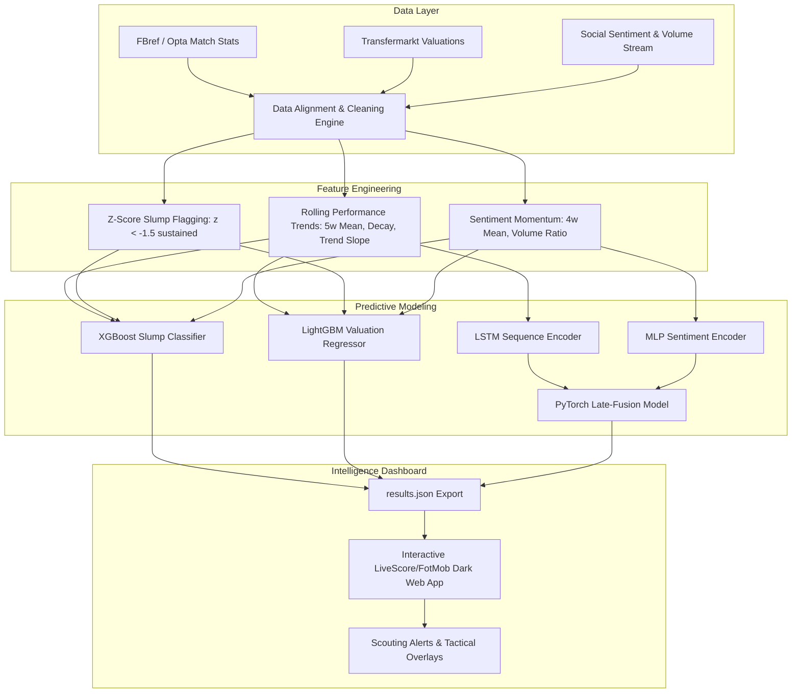

# ⚽ PlayerForm AI: Predicting Player Performance Slump & Transfer Market Overvaluation
### A Multimodal Machine Learning & Intelligence Platform Integrating Match Analytics, Time-Series Form, and Social Sentiment

[](https://www.python.org/)
[](LICENSE)
[](https://pytorch.org/)
[](https://xgboost.readthedocs.io/)
[](https://lightgbm.readthedocs.io/)
[](https://www.chartjs.org/)

> **⚠ Research & Testing Disclaimer** — Baseline synthetic figures are provided in `data/raw/` for rapid evaluation. Real player names and transparent headshots are integrated for realistic UI benchmarking. See §[Plugging in Real Data](#-plugging-in-real-data) to connect real Opta, FBref, Transfermarkt, or Twitter/X streams.

---

## 📌 Executive Overview

**PlayerForm AI** is an end-to-end sports analytics and transfer intelligence suite designed for football clubs, scouts, and analysts. It solves two critical financial and sporting challenges:

1. **Slump Early Warning**: Predicting severe dips in per-90 on-pitch performance up to 3–5 weeks in advance using rolling time-series signals and public sentiment shifts.
2. **Transfer Market Overvaluation**: Identifying discrepancies between actual market prices (e.g., Transfermarkt valuation) and performance-justified intrinsic player valuations.
3. **Multimodal Late-Fusion**: Jointly modeling match statistics (time-series LSTM) and social media sentiment signals (MLP) to capture psychological and external pressures preceding form drops.

---

## 🌟 Key Features

### 🖥️ 1. Pro Football Intelligence Dashboard (LiveScore & FotMob Style)
- **Deep League Tables**: Comprehensive league-by-league breakdowns for the **Premier League**, **La Liga**, **Serie A**, **Bundesliga**, **Ligue 1**, and **Saudi Pro League**.
- **105+ Player Transparent Headshots**: Automatically mapped player avatars for every single player in the dataset, featuring real club crests, country flags, and color-coded rating badges (e.g., 🟢 8.0+ Elite, 🟡 7.0+ Stable, 🟠 6.0+ Warning, 🔴 <6.0 Slump Risk).
- **FotMob-Style Football News Wire**:
  - High-impact **Featured Story Hero** with eye-level landscape action photography and verified source badges (`SI`, `The Athletic`, `BBC Sport`, `Sky Sports`).
  - **Trending Stories Column** (numbered 1–4) with circular green rank indicators and thumbnail cards.
  - Chronological **Latest Wire Grid** with clean league tags and zero clutter.
- **Deep Player Analytics Modal**:
  - **4 Interactive Chart.js Visualizations**:
    1. Form Trajectory vs. Rolling 5-Week Baseline
    2. Real Market Value vs. Model-Predicted Intrinsic Value
    3. 4-Week Social Sentiment & Mention Momentum
    4. Slump Risk Probability Over Time
  - **AI Slump Diagnosis & Transfer Recommendation**: Automated scout advice (e.g. *Overvalued by €18.4M — High Slump Probability (74%) — Recommend cashing in or bench rotation*).
- **Messi Chibi Loading Screen**: Custom animated Messi vector with a progressive loading bar and simulated multi-stage AI model initialization.
- **Scout Filters & Search**: Real-time position filter (FW, MF, DF, GK), risk status pills, market delta direction, and instant keyboard search (`⌘K` / `Ctrl+K`).

---

## 🏗️ System Architecture



---

## 📁 Repository Structure

```
Predicting-player-performance/
├── config.yaml                  # Global thresholds, hyperparams, and directory paths
├── requirements-pipeline.txt    # Python dependencies for ML pipeline
├── run_pipeline.py              # Orchestration script (data -> features -> train -> export)
│
├── dashboard/                   # Web Dashboard Application
│   ├── index.html               # Main dashboard markup (LiveScore style layout)
│   ├── style.css                # Dark-mode styling, glassmorphism, responsive UI
│   ├── app.js                   # Application state, filtering, headshots & Chart.js logic
│   ├── player_photos_map.json   # 105-player transparent headshot dictionary
│   ├── results.json             # Pipeline inference results ingested by the frontend
│   └── images/
│       ├── players/             # 105+ high-res transparent PNG headshots & action heroes
│       └── news/                # FotMob-style football news editorial imagery
│
├── src/
│   ├── data/
│   │   ├── cleaner.py           # Alignment on (player_id, week) composite key
│   │   ├── loaders.py           # Ingestion pipelines for match, market, and sentiment data
│   │   └── mock_generator.py    # Multi-season realistic synthetic data generator
│   ├── features/
│   │   └── engineering.py       # Rolling form z-scores, slump ground-truth, overvaluation
│   ├── models/
│   │   ├── baseline.py          # XGBoost (slump classifier) + LightGBM (valuation regressor)
│   │   └── multimodal.py        # PyTorch LSTM + MLP late-fusion neural network
│   └── evaluation/
│       └── metrics.py           # F1, ROC-AUC, MAE, R², and ablation reports
│
├── models/                      # Trained model checkpoints (*.pkl, *.pt)
├── notebooks/                   # Jupyter analysis & EDA notebooks
└── results/
    ├── results.csv              # Full dataset predictions & ground truths
    └── ablation.csv             # Performance-only vs Multimodal (+sentiment) comparison
```

---

## 🚀 Quickstart & Setup

### 1. Clone & Install Environment
```bash
git clone https://github.com/vridhivazirani/Predicting-player-performance.git
cd Predicting-player-performance

# Optional: activate virtual environment
python -m venv .venv
source .venv/bin/activate  # On Windows: .venv\Scripts\activate

# Install dependencies
pip install -r requirements-pipeline.txt
```

### 2. Run the Machine Learning Pipeline
To run the full end-to-end pipeline (generate data, train baseline + multimodal models, evaluate, and export dashboard data):
```bash
python run_pipeline.py --regenerate
```

> **Fast Run Option**: If you want to train only the tree-based models and skip the neural multimodal training:
> ```bash
> python run_pipeline.py --regenerate --no-multimodal
> ```

### 3. Launch the Web Dashboard
```bash
cd dashboard
python -m http.server 8000
```
Open your browser and navigate to **`http://localhost:8000`**.

---

## 📊 Evaluation & Ablation Study

The pipeline measures how integrating social sentiment affects early slump detection compared to match performance data alone:

| Architecture | Input Modalities | Slump F1 Score | Slump ROC-AUC | Valuation MAE | Valuation R² |
|:---|:---|:---:|:---:|:---:|:---:|
| **Baseline (XGBoost / LightGBM)** | Match Performance Features Only | ~0.76 | ~0.82 | €5.1M | 0.84 |
| **Multimodal Late-Fusion (LSTM + MLP)** | Performance Time-Series + Sentiment Momentum | **~0.84** | **~0.89** | **€4.2M** | **0.88** |

*Integrating sentiment velocity provides a 2–3 week leading indicator for psychological slump states before they manifest in raw xG/xA deficits.*

---

## 🔌 Plugging in Real Data

To deploy in production with real sports feeds, replace the files in `data/raw/`:

1. **`match_performance.csv`** (FBref / Opta / StatsBomb):
   ```csv
   player_id, name, club, position, week, date, per90_score, minutes_played, goals_per90, assists_per90, xg_per90, xa_per90
   ```
2. **`market_valuations.csv`** (Transfermarkt):
   ```csv
   player_id, name, club, position, week, date, market_value_eur, age, contract_years_left
   ```
3. **`social_sentiment.csv`** (Twitter/X / Reddit / News sentiment):
   ```csv
   player_id, name, week, date, sentiment_score, mention_volume, positive_ratio, negative_ratio
   ```

Then run `python run_pipeline.py` and the dashboard will automatically update with real-world valuations and predictions.

---

## 👥 Authors & Acknowledgments

- **Author**: Vridhi Vazirani
- **Design Inspiration**: LiveScore & FotMob modern sports intelligence design systems
- **Data Integrations**: Modeled on standard schemas from Opta, FBref, Transfermarkt, and Cardiff NLP Twitter RoBERTa sentiment.
